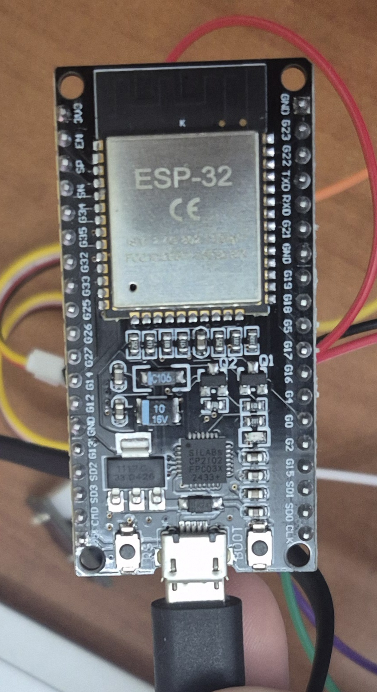
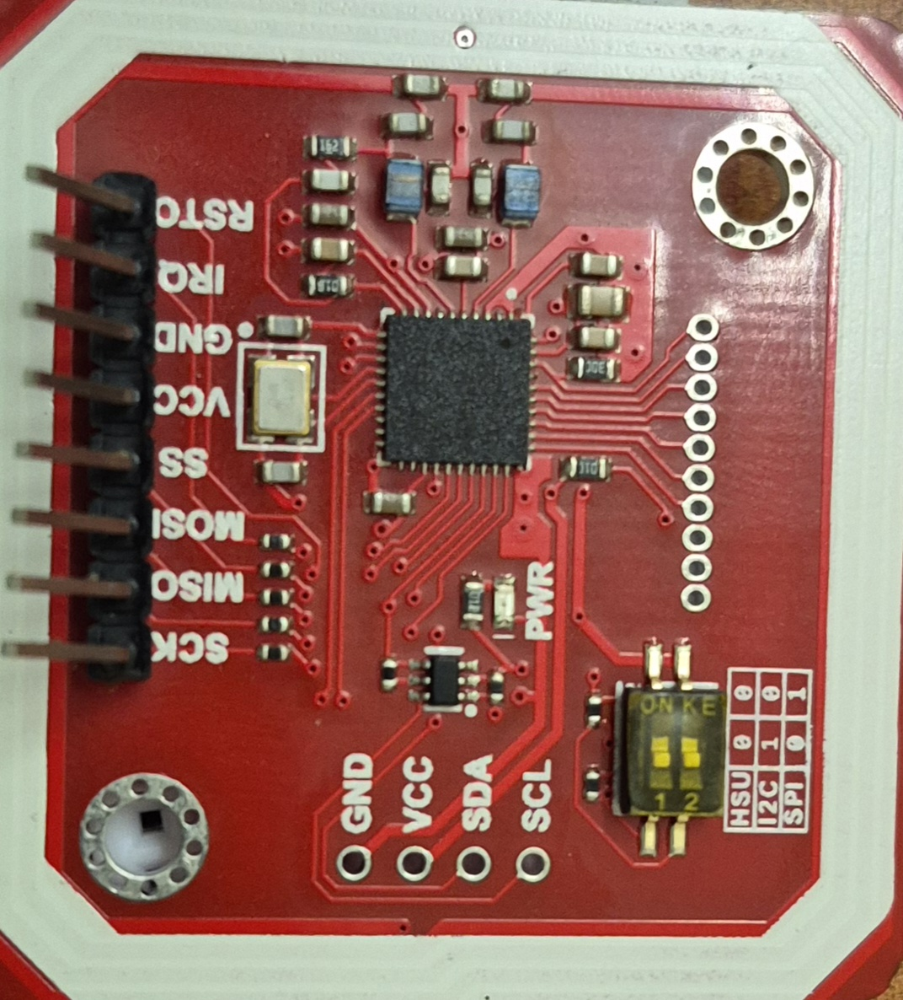
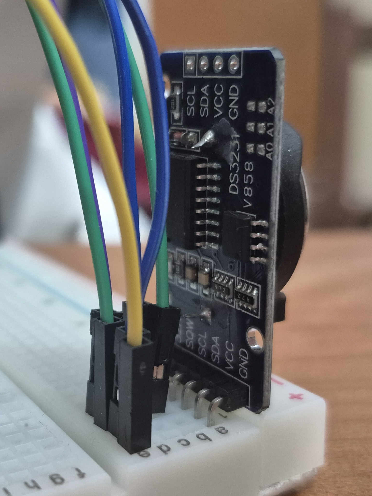
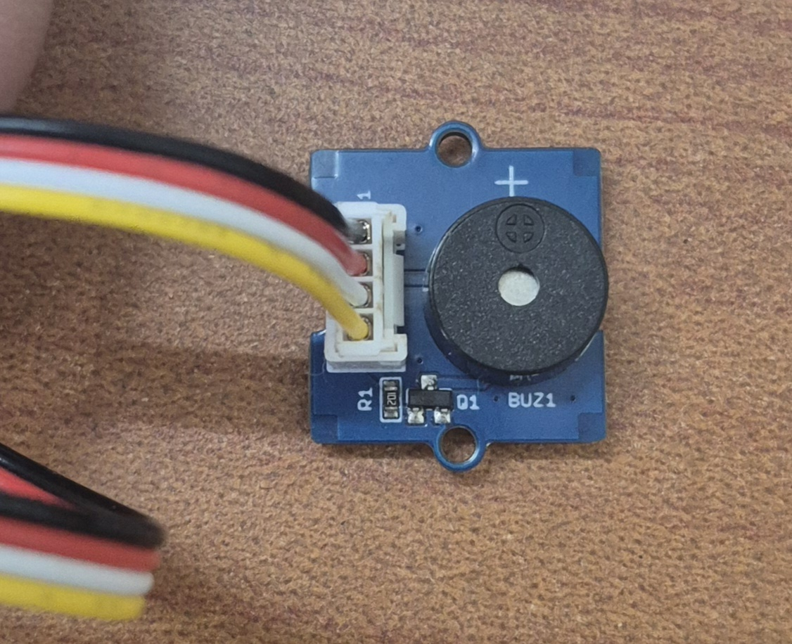
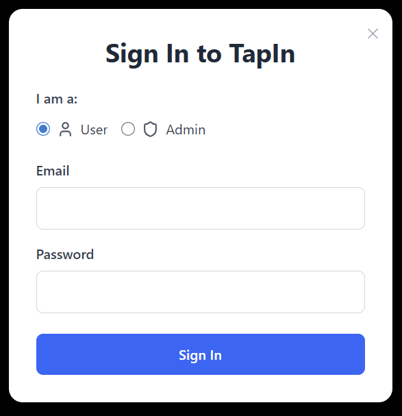
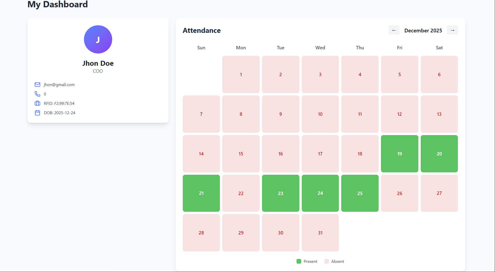
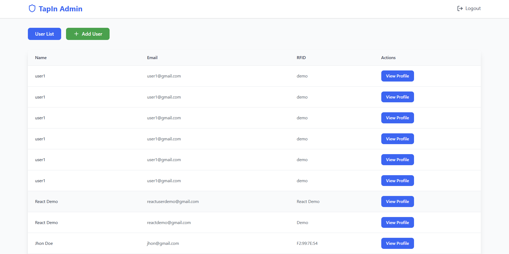

# TapIn : RFID (IoT) based Attendance system. 

## Description
A full-stack web application integrated with a sofisticated IoT system, that records user attendance using RFID/NFC and stores it securely in a database with real-time API integration.

## Tech Stack
- Frontend: React, HTML, Tailwind CSS
- Backend: Node.js, Express.js
- Database: MongoDB
- Authentication: JWT
- Deployment: Vercel, AWS EC2 / Render

## IoT Components used
### ESP32
The ESP32 is a low-cost, low-power System on a Chip (SoC) series with integrated Wi-Fi and dual-mode Bluetooth. It serves as the "brain" of this IoT device. 

### NFC MODULE V3 (PN532)
The PN532 is a highly integrated transmission module for Near Field Communication (NFC) at 13.56 MHz. It acts as the reader that detects the RFID/NFC tags when a user "taps in."

### Real Time Clock (RTC DS3231)
The DS3231 is a high-precision, I2C real-time clock. It tracks seconds, minutes, hours, day, date, month, and year.

### Grove Piezo Buzzer
The Grove Piezo Buzzer is a simple output component that creates sound using a piezoelectric element. It provides audible feedback (a "beep") to let the user know their tap was successfully registered.

## Features
- User authentication and authorization.
- RFID/NFC attendance logging.
- REST API for attendance records.
- Secure database storage.
- Responsive frontend UI.

## Project Architecture

This system follows a centralized backend architecture where all clients 
(frontend and IoT devices) communicate securely with the backend API. 
The backend is responsible for authentication, business logic, and database access.

## Installation & Setup
1. Clone the repository
2. Install backend dependencies
3. Install frontend dependencies
4. Setup environment variables

Backend: npm run start
Frontend: npm run dev

## API Endpoints
### No Auth
1. POST /api/v1/user/login
2. POST /api/v1/admin/login

### Authenticated User
1. GET /api/v1/user/profile
2. GET /api/v1/user/attendance
3. POST /api/v1/user/attendanceForAdmin

### Authenticated Admin
1. POST /api/v1/admin/adduser
2. GET /api/v1/admin/dashboard
3. POST /api/v1/admin/UserProfile

### To record attendance from IoT device.
1. POST /api/v1/events/rfidscan

The IoT device communicates with the backend using HTTP-based REST APIs over Wi-Fi.

## Screenshots

Role based sign in, by selecting user OR admin.

After sign in, users can see their profile card and their attendances.

After sign in, admin can see list of user with their basic details and further can see user's profile too. By clicking the "Add user " button Admin can add new users also. 

